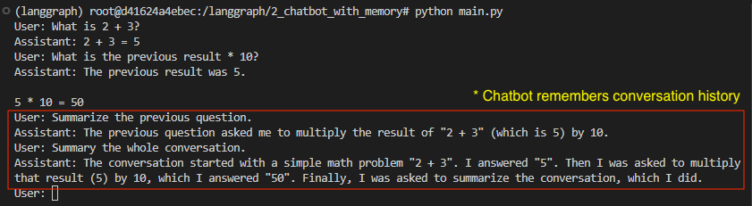
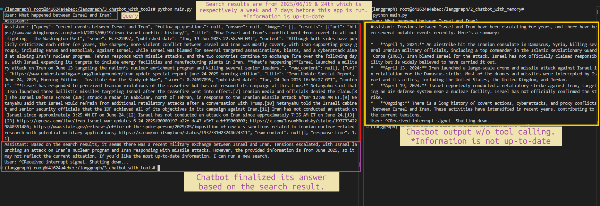
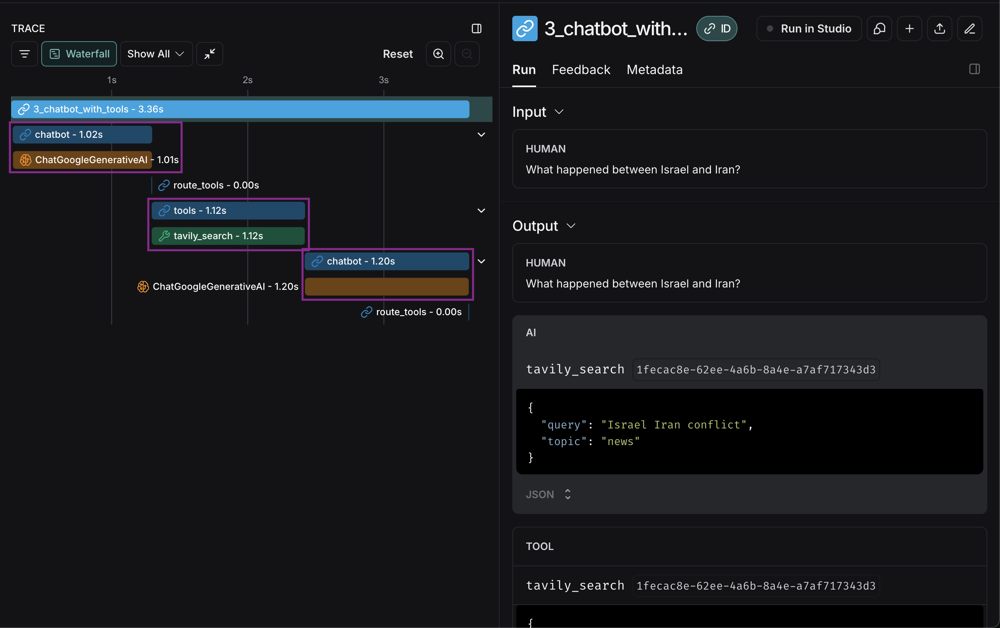

## LangGraph Chatbot mini projects

**Prerequisite**
You will need to have a Gemini API Key in order to run codes in this repository. you can [get it for free in Google AI Studio](https://aistudio.google.com/app/apikey).

Run below 3 commands:

```bash
$ git clone https://github.com/sophot/langgraph-projects.git
$ cd langgraph-projects
$ cp .env.example .env
```

Then copy and paste the API Key to '.env' file.


**I. Sync dependencies and update lockfile.**

```bash
$ uv sync
```

<br />

**II. Activate an independent environment to work with.**

```bash
$ source .venv/bin/activate
```

<br />

**III. Run**
Go to any project folder to run to interact with the chatbot.

<hr />

**1. Simple Chatbot [[code]](1_simple_chatbot/main.py)**
- This chatbot doesn't have memory previous conversation. To the LLM, each question is independent from the other.

This is the graph of our Chatbot app:


```bash
$ python 1_simple_chatbot/main.py
```
Output:


<hr />

**2. Chatbot with Memory [[code]](2_chatbot_with_memory/main.py)**
- We add a memory to the chatbot, now it remembers the history of past conversations.
```bash
$ python 2_chatbot_with_memory/main.py
```
Output:


<hr />

**3. Chatbot with Tools Calling [[code]](3_chatbot_with_tools/main.py)**
- Now, we integrate a web search tool. The chatbot can use this tool to find relevant information to provide better responses.

You'll need [Tavily API Key](https://www.tavily.com/) in order to run the code. Tavily is an AI-powered search API talored for LLMs.
Beside Tavily, there are [other online search tools]((https://python.langchain.com/docs/integrations/tools/)) supported by LangChain/LangGraph.

This is the graph of our Chatbot app:


> First, a `ToolNode` is defined, ToolNode is a  node that runs the tools called in the last AIMessage. <br />
> Then, `conditional_edeges` is defined to route to different nodes depending on the current graph `state`. <br />
> A `tools_condition` function is also needed for the `chatbot node`. It returns **"tools"** if the chatbot asks to use a tool, and **"END"** if it is fine directly responding. This conditional routing defines the main agent loop.

```bash
$ python 3_chatbot_with_tools/main.py
```
Output:


**LangSmith**

We can monitor, analyze and debug how the application works with LangSmith. However, you need to have a LangSmith account in order the get the API key. <br />
Then add below lines to the environment (.env) file.
```sh
LANGSMITH_TRACING=true
LANGSMITH_ENDPOINT="https://api.smith.langchain.com"
LANGSMITH_API_KEY=
```

[Click to interact with LangSmith Trace](https://smith.langchain.com/public/7afa02a4-c583-41b7-8fb1-e129e3d379b8/r):



<hr />

**4. Chatbot with Human-in-the-Loop [[code]](4_chatbot_with_human_in_the_loop/main.py)**
- Agent can be unreliable and may need human input to sucessfully accomplish tasks.
- Some actions require human approval before running to ensure that everything is running as intended.
