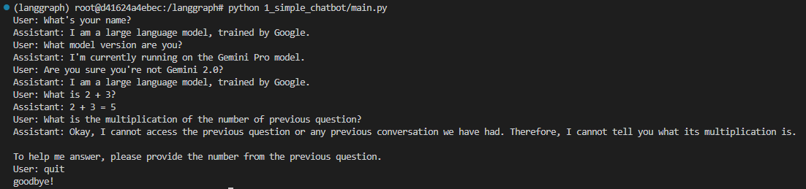

## LangGraph Chatbot mini projects

```bash
$ git clone https://github.com/sophot/langgraph-projects.git
```


**I. Sync dependencies and update lockfile.**

```bash
$ uv sync
```

<br />

**II. Activate an independent environment to work with.**

```bash
$ source .venv/bin/activate
```

<br />

**III. Run**
Go to any project folder to run to interact with the chatbot.

**1. Simple Chatbot [[code]](1_simple_chatbot/main.py)**
- This chatbot doesn't have memory previous conversation. To the LLM, each question is independent from the other.
```bash
$ python 1_simple_chatbot/main.py
```
Output:

